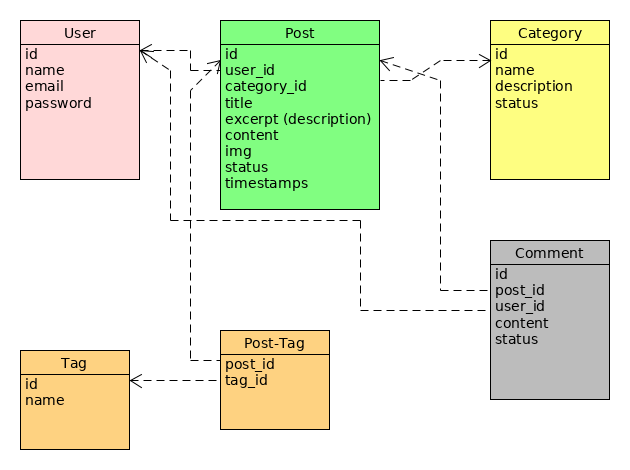

# Blog

## Lesson 1
 * UML - построение Entity Relations
 
 * Установка Laravel: composer laravel/larave blog
 * становка Debug Bar: composer require barryvdh/laravel-debugbar --dev

## Lesson 2
 * Разбиение готового шаблона на представления layouts, partials

## Lesson 3
 * Построение моделей, миграций и заполнение данными
 ```
 php artisan make:model Post -a
 php artisan make:model Category -a
 ```
 - migration:
```php
    public function up()
    {
        Schema::create('posts', function (Blueprint $table) {
            $table->bigIncrements('id');
            $table->bigInteger('user_id')->index()->unsigned();
            $table->bigInteger('category_id')->index()->unsigned();
            $table->string('title');
            $table->string('description');
            $table->text('content');
            $table->string('cover_img');
            $table->integer('status');
            $table->timestamps();
        });
    }
    ...
        public function up()
    {
        Schema::create('categories', function (Blueprint $table) {
            $table->bigIncrements('id');
            $table->string('name');
            $table->string('description');
            $table->integer('status');
            $table->timestamps();
        });
    }
```
	- factory:
```php
$factory->define(App\Post::class, function (Faker $faker) {
	return [
		'user_id' => $faker->numberBetween(1,2),
		'category_id' => $faker->numberBetween(1,10),
		'title' => $faker->sentence,
		'description' => $faker->sentence(20),
		'content' => $faker->text(1000),
		'cover_img' => basename($faker->image('storage/app/public/images', 750, 300)),
		'status' => 1,
	];
});
...
$factory->define(App\Category::class, function (Faker $faker) {
        return [
        'name' => $faker->word,
        'description' => $faker->text,
        'status' => 1
    ];
});
```


## Lesson 4
 * Построение главной страницы с пагинацией
 контроллер:
 ```php
     public function index()
    {
        $posts = Post::simplePaginate(3);
        // dd($posts);
        return view('frontend.index', compact('posts'));
    }
```

 представление:

```
@extends('frontend.layouts.main')
@section('css')
 <link href="css/blog-home.css" rel="stylesheet">
@endsection
@section('content')
<h1 class="my-4">Page Heading
	<small>Secondary Text</small>
</h1>

@if(count($posts))
@foreach($posts as $post)
<!-- Blog Post -->
<div class="card mb-4">
	cover_img}}" alt="Card image cap">
	<div class="card-body">
		<h2 class="card-title">{{$post->title}}</h2>
		<p class="card-text">
			{{$post->description}}
		</p>
		<a href="#" class="btn btn-primary">Read More &rarr;</a>
	</div>
	<div class="card-footer text-muted">
		Posted on {{$post->created_at->format('d/m/Y H:i:s')}} by
		<a href="#">{{$post->user->name}}</a>
	</div>
</div>
@endforeach
@else
	<h1>No posts yet..</h1>
@endif

<!-- Pagination -->
{{$posts->links()}}
@endsection

```
## Lesson 5 
 * Отображение поста
 	- 1
```php
    public function show($id)
    {
        $post = Post::find($id);
        return view('frontend.show', compact('post'));
    }
```
	- 2
```php
    public function show(Post $post)
    {
        return view('frontend.show', compact('post'));
    }
```

 * Отображение категорий
 ```php
  view()->composer('layout.sidebar', function($view){
            $categories =  Category::pluck('name');
            $view->with(compact('categories'));
        });
```